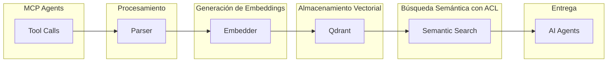

Documento de arquitectura técnica que define la estructura de Alejandria como plataforma de gestión de conocimiento organizacional. Contiene descripción del sistema, arquitectura esencial, decisiones fundamentales de tecnología, estrategia de datos, seguridad, confiabilidad y plan de escalabilidad para soportar la visión de memoria colectiva organizacional.

---

# MVP System Architecture - Alejandria

## Qué es Alejandria

Imagina tener un wiki accesible via MCP para que los agentes de IA puedan acceder a él. Así es como funciona Alejandria: un sistema que captura, conecta y hace accesible el conocimiento organizacional para que cualquier agente de IA pueda encontrar contexto relevante.

No es otra herramienta de documentación. Es un sistema de conocimiento organizacional que:
- En el MVP: El contenido se genera directamente via MCP por los agentes
- Sincronización e indexación en background (no público)
- Provee acceso nativo para agentes de IA via MCP
- Futuro: Aprenderá continuamente de fuentes externas (GitHub, Jira, Slack, Notion, emails)

## Arquitectura Esencial

### Flujo Principal (MVP)

**Entrada → Procesamiento → Almacenamiento → Búsqueda → Entrega**



### Flujo Principal (Futuro)

Las fases futuras (ingestión automática desde fuentes externas, knowledge graph, etc.) se describen en el product brief (PROD-STRAT-0001). Este documento se enfoca en el MVP.

### Componentes Esenciales (MVP)

**1. Procesamiento de Contenido via MCP**
- Tool calls desde agentes de IA para crear/editar documentos
- Parser y cleaner para normalizar contenido
- Chunker inteligente para dividir contenido en unidades semánticas (piensa en esto como dividir un libro en capítulos)
- Extractor de metadata (autor, fecha, tipo, relaciones)

**2. Generación de Embeddings**
- Modelo de embeddings open source (sentence-transformers)
- Procesamiento por batches para eficiencia
- Cache de embeddings para contenido sin cambios (no regeneramos lo que ya existe)
- Modelo inicial: all-MiniLM-L6-v2 (23MB, rápido), migración a all-mpnet-base-v2 (420MB, más preciso) cuando sea necesario

**3. Almacenamiento Vectorial**
- Qdrant como vector database (piensa en esto como un índice inteligente que entiende significado, no solo palabras)
- Metadata asociada a cada embedding (ACL, organización, autor)
- Índices optimizados para búsqueda semántica

**4. Almacenamiento de Documentos**
- PostgreSQL para documentos originales y metadata (tu base de datos confiable)
- Schema normalizado con índices en campos frecuentemente consultados
- Relaciones entre documentos, organizaciones y usuarios

**5. Búsqueda Semántica con ACL**
- Query embedding y búsqueda por similitud en Qdrant
- Filtros por ACL (privado/público, lectura/escritura, lista de acceso)
- Filtros por organización y usuario
- Reranking con contexto adicional (para encontrar exactamente lo que necesitas)

**6. MCP Server con FastMCP**
- FastMCP framework para integración MCP simplificada
- Endpoints para crear, editar, buscar y eliminar documentos
- Autenticación y autorización por organización y ACL
- Gestión automática de schema, validación y documentación

### Componentes Futuros

Las funcionalidades futuras (ingestión automática desde fuentes externas, knowledge graph, API web para gestión de documentos, etc.) se describen en el product brief (PROD-STRAT-0001). Este documento se enfoca en el MVP.

## Decisiones Fundamentales

### 1. Stack Tecnológico Principal

**Backend: Python + FastMCP**
- **Por qué**: Ecosistema maduro para ML/AI, FastMCP simplifica integración MCP con schema automático, validación y documentación
- **Contribución a la visión**: Permite iteración rápida en desarrollo MCP, maneja automáticamente transporte, autenticación y lifecycle
- **Viabilidad**: FastMCP es framework de Prefect con soporte activo, más simple que SDK oficial de MCP

**Vector Database: Qdrant**
- **Por qué**: Vector database especializado con excelente performance, soporte nativo para filtros de metadata (ACL, organización)
- **Contribución a la visión**: Búsqueda semántica con filtros de seguridad integrados desde el inicio
- **Viabilidad**: Open source, puede ser self-hosted o managed, excelente documentación

**Base de Datos: PostgreSQL**
- **Por qué**: Para documentos originales, metadata, relaciones entre usuarios, organizaciones y documentos
- **Contribución a la visión**: Almacenamiento confiable de contenido estructurado con relaciones complejas
- **Viabilidad**: Tecnología conocida y madura, excelente para datos relacionales

**Embeddings: sentence-transformers (all-MiniLM-L6-v2)**
- **Por qué**: Modelo open source maduro, multi-dominio, costo cero (self-hosted), excelente performance para español e inglés
- **Contribución a la visión**: Entendimiento semántico desde día 1 sin dependencias de APIs externas
- **Viabilidad**: Modelo ligero (23MB), puede ejecutarse localmente, puede migrar a modelos más grandes (all-mpnet-base-v2) en fases futuras

### 2. Arquitectura de Datos

**Esquema de Organizaciones**
```json
{
  "id": "org-unique-id",
  "name": "nombre organización",
  "type": "personal|team",
  "owner": "user-id",
  "members": ["user-id-1", "user-id-2"],
  "created_at": "ISO-8601"
}
```

**Esquema de Documentos (PostgreSQL)**
```json
{
  "id": "doc-unique-id",
  "organization_id": "org-unique-id",
  "owner": "user-id",
  "title": "título documento",
  "description": "descripción breve del documento",
  "current_version_id": "version-unique-id",
  "area_id": "area-uuid",  // Foreign key a document_areas (valores por defecto: engineering, product, executive, operations)
  "type_id": "type-uuid",  // Foreign key a document_types (valores por defecto: definition, strategy, guide, record, reference, research)
  "status": "active|draft|deprecated|archived",
  "created_at": "ISO-8601",
  "updated_at": "ISO-8601",
  "acl": {
    "visibility": "private|public",
    "permissions": {
      "default": "read|write|none",
      "specific_users": [
        {"user_id": "user-id", "permission": "read|write|none"}
      ]
    }
  },
  "metadata": {
    "tags": ["tag1", "tag2"],
    "related_docs": ["doc-id-1", "doc-id-2"]
  }
}
```

**Esquema de Versiones de Documentos (PostgreSQL)**
```json
{
  "id": "version-unique-id",
  "document_id": "doc-unique-id",
  "version": "1.0",
  "content": "texto original de esta versión",
  "created_by": "user-id",
  "created_at": "ISO-8601",
  "parent_version_id": "version-id-anterior|null"
}
```

**Nota:** Los chunks y embeddings se almacenan en Qdrant (vector database), no en PostgreSQL. El esquema de documentos contiene solo metadata y referencia a la versión actual. El contenido completo se mantiene en la tabla `document_versions`.

**Sistema de Versionamiento**
- Cada edición crea una nueva versión en `document_versions` con contenido completo
- El documento principal solo contiene metadata y referencia `current_version_id`
- `parent_version_id` permite construir cadena de versiones para diffs
- Se puede realizar diff entre cualquier versión comparando `content` en `document_versions`

**Estrategia de Chunking (Qdrant)**
- Chunking semántico basado en párrafos y secciones
- Overlap del 20% (10% previo, 10% posterior) entre chunks para mantener contexto
- Cada chunk hereda ACL del documento padre
- Los chunks se regeneran y actualizan en Qdrant cuando se crea una nueva versión

**Esquema de Chunk (Qdrant)**
```json
{
  "id": "chunk-unique-id",
  "document_id": "doc-unique-id",
  "document_version": "1.0",
  "organization_id": "org-unique-id",
  "text": "fragmento semántico",
  "embedding": [vector],
  "metadata": {
    "chunk_index": 0,
    "acl": "heredado del documento",
    "created_at": "ISO-8601"
  }
}
```

**Separación de Concerns:**
- **PostgreSQL (documents)**: Almacena versión actual de documentos con metadata, relaciones, ACL
- **PostgreSQL (document_versions)**: Almacena historial de versiones con contenido, change_summary, parent_version_id
- **Qdrant**: Almacena chunks con embeddings para búsqueda semántica, con referencia a document_id y document_version

**Metadata Estratégica**
- **Organización**: ID de organización dueña del documento
- **ACL**: Visibilidad (private/public), permisos por defecto, permisos específicos por usuario
- **Área**: engineering, product, executive, operations (sigue estructura de documentación del proyecto)
- **Tipo**: definition, strategy, guide, record, reference, research (sigue estructura de documentación del proyecto)
- **Tags**: Etiquetas para categorización
- **Relaciones**: IDs de documentos relacionados (related_docs)

### 3. Búsqueda Semántica con ACL

**Pipeline de Búsqueda**
1. **Query Processing**: Normalizar query, detectar intención
2. **Embedding**: Generar embedding del query
3. **Vector Search**: Búsqueda por similitud coseno en Qdrant (top-k = 20)
4. **ACL Filtering**: Filtrar resultados por organización y permisos del usuario
   - Documentos públicos: accesibles por todos
   - Documentos privados: solo accesibles por owner y usuarios en lista de acceso
   - Permisos: verificar read/write antes de retornar resultado
5. **Reranking**: Reordenar usando metadata y contexto adicional
6. **Context Assembly**: Ensamblar respuesta con chunks relevantes

**Filtros de Seguridad**
- Por organización: solo documentos de la organización del usuario
- Por ACL: respetar visibility (private/public) y permissions
- Por usuario: verificar si usuario está en lista de acceso específica

**Mejoras de Búsqueda Futuras**
Las mejoras futuras de búsqueda (hybrid search, query expansion, personalización, knowledge graph) se describen en el product brief (PROD-STRAT-0001).

## Viabilidad y Crecimiento

### Escenario 10x: Crecimiento Predecible

**Límite Actual**: Qdrant self-hosted maneja ~10M embeddings con latencia <100ms
**Se Rompe**: Después de ~50M embeddings, queries lentos >500ms
**Solución 1-hora**: Migrar a Qdrant Cloud con zero downtime usando snapshot/restore
**Resultado**: Escalabilidad a 1B+ embeddings con latencia <50ms

**Límite Actual**: PostgreSQL maneja ~1M documentos con queries <100ms
**Se Rompe**: Después de ~10M documentos, queries lentos >500ms
**Solución 1-hora**: Implementar partitioning por organización + índices adicionales
**Resultado**: Escalabilidad a 100M+ documentos con latencia <100ms

### Plan de Escalabilidad del MVP

**Escalabilidad Predecible**
- Qdrant self-hosted maneja ~10M embeddings con latencia <100ms
- PostgreSQL maneja ~1M documentos con queries <100ms
- Migración a Qdrant Cloud cuando sea necesario (snapshot/restore)
- Partitioning por organización en PostgreSQL cuando crezca

**Fases Futuras**
El roadmap completo de fases futuras (expansión, knowledge graph, enterprise) se describe en el product brief (PROD-STRAT-0001).

## Datos y Persistencia

### Almacenamiento Principal

**PostgreSQL**
- **Propósito**: Documentos originales, organizaciones, usuarios, relaciones, ACL
- **Schema**: Normalizado con índices en campos frecuentemente consultados (organization_id, owner, acl.visibility)
- **Tablas principales**: organizations, users, documents, document_acl, document_tags
- **Backup**: Daily backups con retention 30 días

**Qdrant**
- **Propósito**: Embeddings con búsqueda de similitud y filtros de metadata
- **Collections**: Una colección por organización para aislamiento
- **Metadata**: organization_id, document_id, acl (heredado del documento)
- **Deployment**: Self-hosted con Docker (puede migrar a Qdrant Cloud cuando sea necesario)

### Estrategia de Sincronización (MVP)

- Sin sincronización externa
- Contenido generado directamente via MCP por agentes
- Indexación en background cuando se crea/edita un documento

**Fases Futuras**
La sincronización automática desde fuentes externas (GitHub, Jira, Slack, Notion) se describe en el product brief (PROD-STRAT-0001).

## Seguridad y Confiabilidad

### Seguridad

**Autenticación (MVP)**
- API keys simples por usuario

**Fases Futuras**
OAuth 2.0 + SSO (Google, GitHub, Okta) se describen en el product brief (PROD-STRAT-0001).

**Autorización por Organizaciones y ACL**
- **Organizaciones**: Cada usuario tiene una organización personal por defecto, puede crear organizaciones de team/enterprise
- **ACL por documento**:
  - `visibility`: private (solo owner + lista de acceso) o public (todos en organización)
  - `permissions.default`: read, write, o none para miembros de organización
  - `permissions.specific_users`: Lista de usuarios con permisos específicos (read/write/none)
- **Verificación en cada búsqueda**: Filtrar resultados por organización + ACL del usuario

**Modelo de Seguridad**
```
Usuario → Pertenece a Organización → Tiene permisos en documentos via ACL
├─ Documentos públicos: accesibles por todos en organización
├─ Documentos privados: solo owner + usuarios en lista de acceso
└─ Permisos: read/write verificados antes de retornar resultado
```

**Encriptación**
- TLS 1.3 para todas las conexiones
- Encriptación at-rest para datos sensibles en PostgreSQL
- API keys encriptadas en database

**Data Privacy (MVP)**
- Data retention policies configurables por organización

**Fases Futuras**
PII detection, redaction y compliance con GDPR se describen en el product brief (PROD-STRAT-0001).

### Confiabilidad

**Disponibilidad (MVP sin SLA formal)**
- Single instance con backups diarios
- Mejores prácticas implementadas pero sin SLA formal

**Fases Futuras**
Multi-instance con load balancing se describe en el product brief (PROD-STRAT-0001).

**Monitoreo**
- Metrics: Latencia de búsqueda, tasa de error, indexación rate
- Logs: Structured logging con contexto de request
- Alerts: Latencia >1s, error rate >5%, indexación fallida
- Health checks para Qdrant, PostgreSQL y FastMCP server

**Recovery**
- RTO: 4 horas (restore desde backup)
- RPO: 24 horas (backup diario)
- Disaster recovery plan documentado
- Rollback plan para actualizaciones

## Integración con Agentes de IA

### MCP Server con FastMCP

**Framework: FastMCP**
- Simplifica integración MCP con schema automático, validación y documentación
- Maneja automáticamente transporte, autenticación y lifecycle
- Decoradores @mcp.tool para definir endpoints
- Más simple y Pythonic que SDK oficial de MCP

**Endpoints MCP (Solo gestión de documentos)**
- `create_document`: Crear nuevo documento via MCP (con ACL)
- `update_document`: Editar documento existente mediante patches (verificar permisos de escritura)
- `search`: Búsqueda semántica con query natural (filtrar por ACL)
- `get_document`: Recuperar documento específico (verificar permisos de lectura)
- `delete_document`: Eliminar documento (solo owner)
- `list_documents`: Listar documentos de una organización (filtrar por ACL)

**API Web (Gestión de usuarios, organizaciones y back office)**
- `create_user`: Crear nuevo usuario
- `create_organization`: Crear nueva organización
- `login`: Generar token de autenticación

**Optimizaciones para AI**
- Respuestas en formato estructurado (JSON con metadata)
- Context window optimizado (máximo 4k tokens por respuesta)
- Citas explícitas a fuentes originales
- Confidence scores para cada resultado
- ACL enforcement en cada endpoint

**Integraciones Soportadas**
- Claude Desktop/CLI (nativo via MCP)
- Cursor (nativo via MCP)
- VS Code (via extensión MCP)
- GitHub Copilot (via plugin futuro)

## Próximos Pasos Técnicos

**Investigación Requerida**
- Prototipar chunking strategies para diferentes tipos de contenido
- Evaluar performance de Qdrant self-hosted vs Qdrant Cloud
- Diseñar schema detallado de PostgreSQL para organizaciones, usuarios, documentos y ACL

**Decisiones Pendientes**
- Proveedor de cloud (AWS vs GCP vs Azure) para hosting
- Estrategia de deployment (Docker Compose local vs Kubernetes)

**Riesgos Identificados**
- Performance de ACL filtering en búsquedas semánticas a gran escala
- Complejidad de gestión de permisos granulares por documento
- Adopción de FastMCP vs SDK oficial de MCP a largo plazo

## Conexión con Visión

Esta arquitectura MVP soporta directamente la frase memorable de la visión:

**"Nunca más tendrás que preguntar '¿Dónde carajos está la información sobre esta decisión?'"**

- **Búsqueda semántica con ACL**: Qdrant + embeddings + filtros de seguridad por organización y documento
- **Wiki accesible via MCP**: FastMCP server para que los agentes de IA puedan crear, buscar y editar documentos
- **Organizaciones como base**: Cada usuario tiene organización personal, puede crear organizaciones de team/enterprise
- **Permisos granulares**: ACL por documento (privado/público, lectura/escritura, lista de acceso específica)
- **Contenido generado por agentes**: MVP con contenido creado directamente via MCP, primer paso hacia la visión
- **Escalabilidad predecible**: Qdrant self-hosted → Qdrant Cloud, PostgreSQL con partitioning

La arquitectura MVP es **simple pero poderosa** porque:
- Componentes mínimos esenciales (MCP → Procesamiento → Qdrant + PostgreSQL → Búsqueda con ACL)
- Crecimiento predecible con migraciones claras (self-hosted → cloud)
- Tecnología conocida por el equipo (Python, FastMCP, Qdrant, PostgreSQL)
- Seguridad integrada desde el inicio (organizaciones + ACL)
- Primer paso sólido hacia la visión de memoria colectiva organizacional
