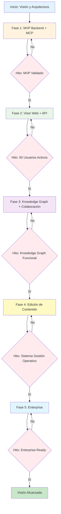

Roadmap estratégico que define la secuencia de implementación de Alejandria desde MVP hasta Enterprise, conectando cada fase con la visión de memoria colectiva organizacional. Contiene 7 fases de desarrollo, asignación de recursos, métricas de éxito y gestión de riesgos para ejecutar la visión estratégica.

---

# Strategic Roadmap - Alejandria

## Índice

1. [Conexión con la Visión](#1-conexión-con-la-visión)
2. [Iniciativas Estratégicas](#2-iniciativas-estratégicas)
3. [Secuencia de Ejecución](#3-secuencia-de-ejecución)
4. [Asignación de Recursos](#4-asignación-de-recursos)
5. [Métricas de Éxito](#5-métricas-de-éxito)
6. [Gestión de Riesgos](#6-gestión-de-riesgos)
7. [Validación del Roadmap](#7-validación-del-roadmap)

## 1. Conexión con la Visión

Frase Memorable de la Visión: "Nunca más tendrás que preguntar ¿Dónde carajos está la información?"

Este roadmap estratégico traduce nuestra visión en iniciativas concretas que nos llevarán de un sistema MVP con backend + MCP a una plataforma completa de memoria organizacional en 25 semanas. Cada iniciativa está diseñada para avanzar directamente hacia eliminar la pregunta "¿Dónde carajos está la información?", asegurando que cada recurso invertido contribuya a nuestro propósito fundamental de crear memoria colectiva organizacional accesible para todos.

### Objetivos Estratégicos Principales
- Objetivo 1: Validar MVP con backend + MCP que capture y busque conocimiento organizacional
- Objetivo 2: Expandir con visor web y API pública para acceso humano y desarrollador
- Objetivo 3: Construir knowledge graph y colaboración para conectar decisiones estratégicas con implementación técnica
- Objetivo 4: Alcanzar enterprise con inteligencia predictiva y capacidades avanzadas

### Criterios de Priorización
- Impacto en visión: ¿Cuánto contribuye esta iniciativa a eliminar la búsqueda manual de información?
- Viabilidad: ¿Tenemos los recursos técnicos y humanos para ejecutar esta iniciativa en el timeline definido?
- Dependencias: ¿Qué iniciativas deben completarse antes (ej. backend antes de visor web, API antes de knowledge graph)?

## 2. Iniciativas Estratégicas

### Iniciativa 1: MVP Backend + MCP
Propósito: Validar que podemos capturar, procesar y buscar conocimiento organizacional via MCP
Descripción: Sistema backend con Python + FastMCP + Qdrant + PostgreSQL que permite a agentes de IA crear, buscar y editar documentos con búsqueda semántica y ACL
Impacto Esperado: Primer sistema funcional que responde "¿Por qué esta decisión?" en 30 segundos
Duración Estimada: 6 semanas

### Iniciativa 2: Visor Web Básico
Propósito: Habilitar acceso humano directo al conocimiento organizacional
Descripción: Interfaz web simple para buscar, ver y navegar documentos almacenados en Alejandria
Impacto Esperado: Usuarios humanos pueden acceder a memoria organizacional sin MCP
Duración Estimada: 3 semanas

### Iniciativa 3: API Pública para Desarrolladores
Propósito: Permitir integraciones externas y ecosistema de desarrolladores
Descripción: API REST/GraphQL pública con documentación completa para que desarrolladores integren Alejandria en sus aplicaciones
Impacto Esperado: Ecosistema de integraciones que amplía alcance de memoria organizacional
Duración Estimada: 3 semanas

### Iniciativa 4: Knowledge Graph Interactivo
Propósito: Visualizar conexiones entre decisiones estratégicas e implementación técnica
Descripción: Grafo interactivo que muestra relaciones entre documentos, decisiones y contexto
Impacto Esperado: Trazabilidad completa desde visión hasta implementación con visualización de impacto
Duración Estimada: 3 semanas

### Iniciativa 5: Colaboración Básica
Propósito: Habilitar edición colaborativa de documentos
Descripción: Sistema de comentarios, sugerencias y edición en tiempo real por múltiples usuarios
Impacto Esperado: Memoria organizacional viva que se actualiza con contribuciones del equipo
Duración Estimada: 3 semanas

### Iniciativa 6: Edición de Contenido
Propósito: Permitir gestión completa del ciclo de vida de documentos
Descripción: Sistema de versioning, aprobación, publicación y archivo de documentos
Impacto Esperado: Flujo de trabajo completo para gestión de conocimiento organizacional
Duración Estimada: 3 semanas

### Iniciativa 7: Inteligencia Predictiva + Enterprise
Propósito: Alcanzar capacidades avanzadas de predicción y enterprise
Descripción: Machine learning para predecir impacto de cambios, SSO, RBAC, compliance enterprise
Impacto Esperado: Plataforma enterprise-ready con inteligencia predictiva
Duración Estimada: 4 semanas

## 3. Secuencia de Ejecución

### Fase 1: Fundamentos (Hito: MVP Validado)
- Iniciativas: MVP Backend + MCP
- Propósito: Validar que la arquitectura técnica puede capturar y buscar conocimiento organizacional con búsqueda semántica y ACL
- Dependencias: Arquitectura definida en ENG-DEF-0001, visión definida en EXEC-STRAT-0001
- Hito de Finalización: Sistema MVP funcional que responde queries MCP con búsqueda semántica en <500ms
- Criterios de Éxito: 10 organizaciones activas, 1000 documentos indexados, búsquedas exitosas >90%

### Fase 2: Acceso Humano (Hito: Primeros Usuarios Activos)
- Iniciativas: Visor Web Básico, API Pública para Desarrolladores
- Propósito: Ampliar acceso más allá de agentes de IA, habilitar ecosistema de integraciones
- Dependencias: MVP Backend + MCP completado
- Hito de Finalización: 50 usuarios activos semanales usando visor web o API
- Criterios de Éxito: Engagement 60%, completitud 70%, NPS > 30

### Fase 3: Conexiones y Colaboración (Hito: Knowledge Graph Funcional)
- Iniciativas: Knowledge Graph Interactivo, Colaboración Básica
- Propósito: Conectar decisiones estratégicas con implementación técnica, habilitar contribución colaborativa
- Dependencias: Visor Web Básico y API Pública completados
- Hito de Finalización: Knowledge graph con 500+ nodos conectados, colaboración activa por 20+ usuarios
- Criterios de Éxito: 30% reducción en preguntas "¿dónde está la documentación?", tiempo de búsqueda reducido 40%

### Fase 4: Gestión Completa (Hito: Sistema de Gestión Operativo)
- Iniciativas: Edición de Contenido
- Propósito: Ciclo de vida completo de documentos con versioning y aprobaciones
- Dependencias: Knowledge Graph y Colaboración completados
- Hito de Finalización: 5000 documentos gestionados con versioning, flujo de aprobación activo
- Criterios de Éxito: 80% de documentos siguen flujo de aprobación, tiempo de ciclo <48h

### Fase 5: Enterprise (Hito: Plataforma Enterprise-Ready)
- Iniciativas: Inteligencia Predictiva + Enterprise
- Propósito: Capacidades avanzadas de predicción, compliance y features enterprise
- Dependencias: Todas las fases anteriores completadas
- Hito de Finalización: 10 clientes enterprise, SSO implementado, predicción de impacto funcional
- Criterios de Éxito: NPS > 50, retención >70%, revenue enterprise >$100K ARR

### Diagrama de Secuencia Basado en Hitos

### Puntos de Decisión Clave
- **Decisión 1:** Después de validar MVP → ¿Continuar con visor web o ajustar backend basado en feedback?
- **Decisión 2:** Al alcanzar usuarios activos → ¿Priorizar API pública o mejorar visor web?
- **Decisión 3:** Con knowledge graph funcional → ¿Escalar a más organizaciones o profundizar features de colaboración?
- **Decisión 4:** Con sistema de gestión operativo → ¿Ir a enterprise o optimizar experiencia usuario?
- **Decisión 5:** Con plataforma enterprise-ready → ¿Expandir a verticales específicos o mantener horizontal?

## 4. Asignación de Recursos

### Recursos Humanos
- Equipo Principal: 1-2 desarrolladores backend (Python/FastMCP), 1 desarrollador frontend (React), 1 product manager
- Stakeholders: Leadership team para aprobaciones, usuarios beta para feedback
- Capacidades Necesarias: FastMCP, Qdrant, PostgreSQL, React, MCP protocol
- Roles Faltantes: Diseñador UX (fase 2+), DevOps (fase 3+), Sales Engineer (fase 5)

### Recursos Financieros
- Presupuesto Total: $50K-100K para MVP completo (25 semanas)
- Distribución por Fase: Fase 1 ($20K), Fase 2 ($15K), Fase 3 ($20K), Fase 4 ($15K), Fase 5 ($30K)
- Inversión por Iniciativa: MVP ($20K), Visor Web ($10K), API ($5K), Knowledge Graph ($15K), Colaboración ($10K), Edición ($10K), Enterprise ($30K)
- Contingencia: 20% de presupuesto para imprevistos técnicos

### Recursos Técnicos
- Infraestructura: Qdrant self-hosted (Docker), PostgreSQL (RDS o self-hosted), FastMCP server
- Software: OpenAI API (embeddings), GitHub Actions (CI/CD), Vercel/Netlify (hosting frontend)
- Capacitación: FastMCP documentation, Qdrant best practices, MCP protocol specification

### Dependencias Externas
- Proveedores: OpenAI (embeddings), cloud provider (AWS/GCP/Azure)
- Partners: MCP ecosystem (Anthropic, Prefect)
- Aprobaciones: Security review para enterprise features

## 5. Métricas de Éxito

### Métricas de Impacto en Visión
- Progreso hacia "Nunca más tendrás que preguntar ¿Dónde carajos está la información?": Reducción de tiempo de búsqueda y preguntas de ubicación de información
- Indicador Principal: Porcentaje de reducción en tiempo de búsqueda de información
- Métricas Secundarias: Número de organizaciones activas, documentos indexados, usuarios activos semanales

### Métricas por Iniciativa
- Iniciativa 1 (MVP): 10 organizaciones activas, 1000 documentos indexados, búsquedas exitosas >90%, latencia <500ms
- Iniciativa 2 (Visor Web): 50 usuarios activos semanales, engagement 60%, completitud 70%
- Iniciativa 3 (API): 1000+ requests/día, 50+ integraciones externas, documentación completa
- Iniciativa 4 (Knowledge Graph): 500+ nodos conectados, 30% reducción en preguntas "¿dónde está?", tiempo búsqueda 40% menos
- Iniciativa 5 (Colaboración): 20+ usuarios colaborando activamente, 100+ comentarios/semana
- Iniciativa 6 (Edición): 5000 documentos gestionados, 80% flujo aprobación, tiempo ciclo <48h
- Iniciativa 7 (Enterprise): 10 clientes enterprise, NPS > 50, retención >70%, revenue >$100K ARR

### Hitos de Validación por Fase
- Hito 1 (MVP Validado): Sistema funcional que responde queries MCP con búsqueda semántica en <500ms
- Hito 2 (Primeros Usuarios Activos): 50 usuarios activos semanales usando visor web o API
- Hito 3 (Knowledge Graph Funcional): 500+ nodos conectados, colaboración activa por 20+ usuarios
- Hito 4 (Sistema Gestión Operativo): 5000 documentos gestionados con versioning
- Hito 5 (Enterprise-Ready): 10 clientes enterprise, SSO implementado, revenue enterprise >$100K ARR

### Métricas de Ejecución Basadas en Eventos
- Velocidad de Progreso: Cada fase completada en timeline estimado (±1 semana)
- Calidad de Entregas: Bugs críticos <5 por fase, uptime >99% para MVP
- Adaptabilidad: Capacidad de ajustar roadmap basado en feedback entre fases

### Sistema de Monitoreo por Hitos
- Frecuencia de Evaluación: Revisión semanal de progreso hacia hitos, retrospectiva al final de cada fase
- Indicadores de Alerta: Latencia >1s, error rate >5%, usuarios activos <80% de target
- Ajustes de Curso: Decisiones de pivot en puntos de decisión clave basados en resultados de hitos

## 6. Gestión de Riesgos

### Riesgos Principales por Hito

#### Riesgo 1: Performance de Búsqueda Semántica - Impacta Hito 1
- Probabilidad: Media
- Impacto en Visión: Podría invalidar la propuesta de valor de respuestas en segundos
- Hito Afectado: MVP Validado
- Descripción: Búsqueda semántica en Qdrant podría ser lenta (>1s) con datasets grandes
- Mitigación: Prototipar con datasets de prueba early, optimizar índices Qdrant, considerar Qdrant Cloud desde inicio
- Plan B: Migrar a Qdrant Cloud con zero downtime si self-hosted no escala
- Indicador de Alerta: Latencia de búsqueda >800ms en pruebas con 10K documentos

#### Riesgo 2: Adopción de MCP - Impacta Hito 2
- Probabilidad: Baja
- Impacto en Visión: Reduciría el diferenciador principal de acceso nativo para agentes de IA
- Hito Afectado: Primeros Usuarios Activos
- Descripción: Ecosistema MCP podría no crecer como esperado o Anthropic podría cambiar estrategia
- Mitigación: Mantener API web como fallback, diversificar integraciones (Claude, Cursor, VS Code, GitHub Copilot)
- Plan B: Enfocar en visor web y API como canales principales si MCP adoption es lenta
- Indicador de Alerta: <100 integraciones MCP activas en ecosistema después de 6 meses

#### Riesgo 3: Complejidad de Knowledge Graph - Impacta Hito 3
- Probabilidad: Alta
- Impacto en Visión: Podría retrasar significativamente el timeline y consumir recursos
- Hito Afectado: Knowledge Graph Funcional
- Descripción: Construir grafo de decisiones de negocio es más complejo que anticipado
- Mitigación: Empezar con grafo simple (documentos relacionados), iterar gradualmente a decisiones de negocio
- Plan B: Reducir scope a grafo de documentos solamente, postergar grafo de decisiones a fase 5
- Indicador de Alerta: Más de 4 semanas para implementar grafo básico de documentos

#### Riesgo 4: Retención de Usuarios - Impacta Hito 4
- Probabilidad: Media
- Impacto en Visión: Sin retención, el valor de memoria organizacional no se materializa
- Hito Afectado: Sistema Gestión Operativo
- Descripción: Usuarios podrían no adoptar Alejandria continuamente después de uso inicial
- Mitigación: Onboarding activo, integraciones con herramientas existentes, métricas de engagement tempranas
- Plan B: Pausar nuevas features, enfocar en experiencia usuario y valor percibido
- Indicador de Alerta: Retención <40% después de 30 días

#### Riesgo 5: Competencia de Notion/Confluence - Impacta Hito 5
- Probabilidad: Media
- Impacto en Visión: Podría erosionar diferenciador si agregan búsqueda semántica
- Hito Afectado: Enterprise-Ready
- Descripción: Notion o Confluence podrían lanzar búsqueda semántica nativa
- Mitigación: Enfocar en diferenciadores defendibles (MCP, knowledge graph de decisiones, aprendizaje automático)
- Plan B: Pivot a vertical específico (ej. equipos técnicos) donde diferenciadores son más fuertes
- Indicador de Alerta: Notion o Confluence anuncian búsqueda semántica nativa

### Estrategia de Adaptación Basada en Hitos
- Puntos de Decisión: Evaluación al final de cada fase para decidir continuar, ajustar scope o pivot
- Flexibilidad entre Hitos: Mantener buffer de 1 semana por fase para ajustes sin perder timeline general
- Comunicación de Cambios: Documentar decisiones de roadmap en changelog, comunicar a stakeholders
- Aceleración o Desaceleración: Si hito se alcanza early, acelerar siguiente fase; si se retrasa, reevaluar roadmap

## 7. Validación del Roadmap

### Alineación con Visión
- Conexión Directa: Cada iniciativa conecta directamente con eliminar la pregunta "¿Dónde carajos está la información?"
- Coherencia Estratégica: Las 7 fases construyen incrementalmente hacia memoria colectiva organizacional completa
- Priorización Adecuada: MVP primero para validación, luego acceso humano, luego conexiones, luego gestión, finalmente enterprise

### Viabilidad de Ejecución
- Recursos Disponibles: Presupuesto $50K-100K y equipo 1-2 devs + 1 PM es realista para 25 semanas
- Timeline Realista: 6+3+3+3+3+3+4 = 25 semanas con buffer de 1 semana por fase es alcanzable
- Dependencias Gestionadas: Cada fase depende de la anterior, milestones claros para validar antes de continuar

### Métricas Claras
- Medibilidad: Todas las métricas son objetivas y medibles (usuarios activos, documentos indexados, latencia, NPS)
- Relevancia: Las métricas miden directamente progreso hacia la visión de eliminar búsqueda manual
- Acciónabilidad: Podemos actuar basados en resultados (ajustar roadmap, optimizar performance, mejorar onboarding)

### Gestión de Riesgos Adecuada
- Cobertura Completa: 5 riesgos principales identificados por hito con planes de mitigación
- Mitigación Viable: Planes B realistas (migrar a Qdrant Cloud, enfocar en visor web, reducir scope de knowledge graph)
- Flexibilidad Estratégica: Puntos de decisión claros al final de cada fase para ajustar basado en resultados
