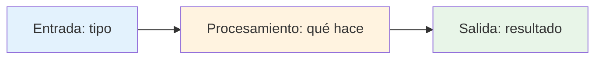

Plantilla estructurada para crear system overview que proporcionen una visión arquitectónica clara del proyecto y garanticen la alineación técnica con los objetivos organizacionales. Use esta plantilla con BOOT-GUIDE-0002 para generar bases técnicas sólidas.

---

# System Overview - [Nombre del Proyecto]

<!--
INSTRUCCIONES:
Esta plantilla está diseñada para los 4 principios fundamentales de arquitectura.
Usa BOOT-GUIDE-0002 para descubrir esta información mediante conversación.
Enfócate solo en lo esencial que soporta tu visión.

GUÍA DE SCOPING POR COMPLEJIDAD:
• Proyecto Simple (MVP): Completa solo secciones 1-3
• Proyecto Medio (Beta): Completa secciones 1-5
• Proyecto Complejo (Producción): Completa todas las secciones

EJEMPLOS DE REFERENCIA:
• Ver BOOT-GUIDE-0002 para ejemplos prácticos de cada principio
• Cada sección debe incluir ejemplos concretos como en la guía
-->

## 1. Qué es [Proyecto]

<!--
INSTRUCCIONES:
Explica el proyecto conectado con tu visión (BOOT-GUIDE-0001).
Responde: ¿Qué experiencia técnica quieres que vivan tus usuarios?
LONGITUD: 50-100 palabras.
EJEMPLO: "Shopify Local es una plataforma que 'transforma cualquier teléfono en una tienda profesional' para lograr que 'cada pequeño negocio se sienta como Fortune 500'. Diseñado para emprendedores locales, resuelve la complejidad técnica del e-commerce mediante una interfaz de voz intuitiva."
-->

{{PLACEHOLDER_START: que_es_proyecto}}

**[Nombre del Proyecto]** es un sistema que **[experiencia técnica clave]** para lograr **[frase memorable de la visión]**.

Diseñado para **[audiencia]**, resuelve **[problema técnico principal]** mediante **[enfoque simple]**.

{{PLACEHOLDER_END: que_es_proyecto}}

## 2. Arquitectura Esencial

<!--
INSTRUCCIONES:
Muestra solo los componentes mínimos necesarios.
Responde: ¿Qué entra, qué se transforma, qué sale?
Usa diagrama simple, no detallado.
EJEMPLO: Para e-commerce simple:
• Entrada: Voz del cliente → Procesamiento: NLP + Catálogo → Salida: Pedido confirmado
• Componentes: Speech-to-text API, Motor de catálogo, Procesador de pagos
-->

{{PLACEHOLDER_START: arquitectura_esencial}}

### Flujo Principal

### Componentes Clave

- [Componente 1]: [Propósito esencial]
- [Componente 2]: [Propósito esencial]
- [Componente 3]: [Propósito esencial]

{{PLACEHOLDER_END: arquitectura_esencial}}

## 3. Decisiones Fundamentales

<!--
INSTRUCCIONES:
Solo las 3 decisiones más importantes que soportan tu visión.
Cada una debe responder: ¿Cómo contribuye esto a [frase memorable]?
EJEMPLO: Para visión "cada pequeño negocio se sienta como Fortune 500":
• Decisión 1: React + Vercel (iteración rápida) → Trade-off: menos performance que Go
• Decisión 2: Stripe para pagos (confianza) → Trade-off: 2.9% fee vs desarrollo propio
• Decisión 3: PostgreSQL (escalabilidad) → Trade-off: más complejo que SQLite
-->

{{PLACEHOLDER_START: decisiones_fundamentales}}

### Decisión 1: [Tecnología/Arquitectura]
Por qué esta decisión: [Razón conectada con visión]
Trade-off aceptado: [Qué sacrificamos por la visión]
Contribución a la visión: [Cómo soporta la frase memorable]

### Decisión 2: [Tecnología/Arquitectura]
Por qué esta decisión: [Razón conectada con visión]
Trade-off aceptado: [Qué sacrificamos por la visión]
Contribución a la visión: [Cómo soporta la frase memorable]

### Decisión 3: [Tecnología/Arquitectura]
Por qué esta decisión: [Razón conectada con visión]
Trade-off aceptado: [Qué sacrificamos por la visión]
Contribución a la visión: [Cómo soporta la frase memorable]

{{PLACEHOLDER_END: decisiones_fundamentales}}

## 4. Evaluación Tecnológica

<!--
INSTRUCCIONES:
Evalúa la tecnología seleccionada y su viabilidad.
Responde: ¿Es esta tecnología la adecuada y cómo escala?
Enfócate en el próximo orden de magnitud, no en infinito.
-->

{{PLACEHOLDER_START: evaluacion_tecnologica}}

### Adecuación Tecnológica

Por qué esta tecnología: [Justificación principal conectada con visión]
Ventajas clave: [Beneficios específicos para el proyecto]
Limitaciones conocidas: [Restricciones o debilidades de la tecnología]
Alternativas consideradas: [Por qué no elegimos otras opciones]

### Estrategia de Crecimiento

¿Qué pasa si crece 10x?: [Primer límite tecnológico que encontraremos]
Cómo lo manejamos: [Solución o actualización necesaria]
Plan de escalado: [Estrategia para próximo orden de magnitud]
Costos esperados: [Recursos necesarios para el crecimiento]

{{PLACEHOLDER_END: evaluacion_tecnologica}}

## 5. Datos y Persistencia

<!--
INSTRUCCIONES:
Describe cómo maneja la información crítica.
Responde: ¿Qué datos necesita recordar el sistema y cómo los protege?
Enfócate en lo esencial para la visión.
-->

{{PLACEHOLDER_START: datos_persistencia}}

### Datos Críticos

Qué necesita recordar: [Tipo de datos esenciales para la visión]
Por qué es importante: [Conexión con frase memorable]
Cuánto tiempo: [Periodo de retención necesario]

### Almacenamiento y Protección

Dónde se guardan: [Tipo de almacenamiento]
Cómo se protegen: [Mecanismos de seguridad básicos]
Backups: [Estrategia de recuperación simple]

{{PLACEHOLDER_END: datos_persistencia}}

## 6. Seguridad y Confiabilidad

<!--
INSTRUCCIONES:
Describe cómo garantizas la seguridad y confiabilidad.
Responde: ¿Qué pasa si algo falla y cómo lo previenes?
Enfócate en lo crítico para cumplir tu visión.
-->

{{PLACEHOLDER_START: seguridad_confiabilidad}}

### Riesgos Principales

#### Riesgo 1
Qué podría fallar: [Riesgo más crítico para la visión]
Impacto en visión: [Cómo afectaría la frase memorable]
Probabilidad: [Alta/Media/Baja]
Cómo lo prevenimos: [Mecanismo principal de protección]
Qué pasa si falla: [Plan de recuperación simple]
Monitoreo: [Cómo sabemos que funciona]

#### Riesgo 2
Qué podría fallar: [Riesgo más crítico para la visión]
Impacto en visión: [Cómo afectaría la frase memorable]
Probabilidad: [Alta/Media/Baja]
Cómo lo prevenimos: [Mecanismo principal de protección]
Qué pasa si falla: [Plan de recuperación simple]
Monitoreo: [Cómo sabemos que funciona]

#### Riesgo N
Qué podría fallar: [Riesgo más crítico para la visión]
Impacto en visión: [Cómo afectaría la frase memorable]
Probabilidad: [Alta/Media/Baja]
Cómo lo prevenimos: [Mecanismo principal de protección]
Qué pasa si falla: [Plan de recuperación simple]
Monitoreo: [Cómo sabemos que funciona]

{{PLACEHOLDER_END: seguridad_confiabilidad}}
