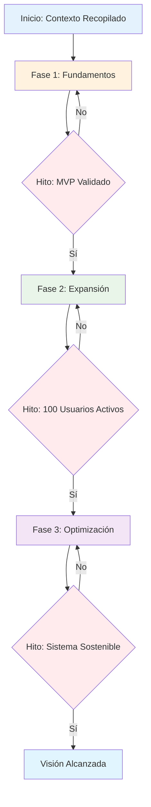

Plantilla estructurada para crear documentos de roadmap estratégico que conecten la visión con la ejecución, garantizando que cada iniciativa tenga propósito claro y que los recursos se asignen estratégicamente. Use esta plantilla con BOOT-GUIDE-0003 para generar roadmaps que ejecutan tu visión.

---

# Strategic Roadmap - [Nombre del Proyecto]

## Índice

<!-- INSTRUCCIONES: Índice navegable - NO modificar -->

1. [Conexión con la Visión](#1-conexión-con-la-visión)
2. [Iniciativas Estratégicas](#2-iniciativas-estratégicas)
3. [Secuencia de Ejecución](#3-secuencia-de-ejecución)
4. [Asignación de Recursos](#4-asignación-de-recursos)
5. [Métricas de Éxito](#5-métricas-de-éxito)
6. [Gestión de Riesgos](#6-gestión-de-riesgos)
7. [Validación del Roadmap](#7-validación-del-roadmap)

## 1. Conexión con la Visión

<!-- INSTRUCCIONES: OBLIGATORIA. Conecta roadmap con visión. Usa frase memorable de BOOT-GUIDE-0001. LONGITUD: 100-150 palabras. -->

{{PLACEHOLDER_START: conexion_vision: Conexión directa con frase memorable y objetivos estratégicos}}

Frase Memorable de la Visión: "[Frase memorable de 6-8 palabras de BOOT-GUIDE-0001]"

Este roadmap estratégico traduce nuestra visión en iniciativas concretas que nos llevarán de [estado actual] a [estado deseado] en [timeline específico]. Cada iniciativa está diseñada para avanzar directamente hacia [frase memorable], asegurando que cada recurso invertido contribuya a nuestro propósito fundamental.

### Objetivos Estratégicos Principales
- Objetivo 1: [Objetivo principal conectado con visión]
- Objetivo 2: [Objetivo principal conectado con visión]
- Objetivo 3: [Objetivo principal conectado con visión]

### Criterios de Priorización
- Impacto en visión: ¿Cuánto contribuye esta iniciativa a [frase memorable]?
- Viabilidad: ¿Tenemos los recursos necesarios para ejecutar esta iniciativa?
- Dependencias: ¿Qué iniciativas deben completarse antes?

{{PLACEHOLDER_END: conexion_vision}}

## 2. Iniciativas Estratégicas

<!-- INSTRUCCIONES: OBLIGATORIA. Detalla 3-5 iniciativas clave. Enfócate en impacto, no cantidad. LONGITUD: 200-300 palabras. -->

{{PLACEHOLDER_START: iniciativas_estrategicas: Iniciativas principales con descripción y justificación}}

### Iniciativa 1: [Nombre de la Iniciativa]
Propósito: [Cómo contribuye a la frase memorable]
Descripción: [Qué es y qué logrará]
Impacto Esperado: [Resultado específico y medible]
Duración Estimada: [Timeline para completar]

### Iniciativa 2: [Nombre de la Iniciativa]
Propósito: [Cómo contribuye a la frase memorable]
Descripción: [Qué es y qué logrará]
Impacto Esperado: [Resultado específico y medible]
Duración Estimada: [Timeline para completar]

### Iniciativa 3: [Nombre de la Iniciativa]
Propósito: [Cómo contribuye a la frase memorable]
Descripción: [Qué es y qué logrará]
Impacto Esperado: [Resultado específico y medible]
Duración Estimada: [Timeline para completar]

### Iniciativas Futuras (Post-MVP)
- Iniciativa 4: [Nombre y breve descripción]
- Iniciativa 5: [Nombre y breve descripción]

{{PLACEHOLDER_END: iniciativas_estrategicas}}

## 3. Secuencia de Ejecución

<!--
INSTRUCCIONES:
- Esta sección es OBLIGATORIA. Define el orden óptimo de ejecución.
- Muestra cómo las iniciativas se construyen sobre sí mismas.
- LONGITUD RECOMENDADA: 150-200 palabras totales.
-->

{{PLACEHOLDER_START: secuencia_ejecucion: Fases y orden de implementación basado en hitos}}

### Fase 1: Fundamentos (Hito: Validación de MVP)
- Iniciativas: [Lista de iniciativas de esta fase]
- Propósito: [Por qué estas iniciativas primero]
- Dependencias: [Qué se necesita antes de empezar]
- Hito de Finalización: [Evento o resultado que marca el fin de esta fase]
- Criterios de Éxito: [Cómo sabemos que esta fase está completa]

### Fase 2: Expansión (Hito: Primeros Usuarios Activos)
- Iniciativas: [Lista de iniciativas de esta fase]
- Propósito: [Cómo esta fase construye sobre la anterior]
- Dependencias: [Qué se necesita de la fase 1]
- Hito de Finalización: [Evento o resultado que marca el fin de esta fase]
- Criterios de Éxito: [Cómo sabemos que esta fase está completa]

### Fase 3: Optimización (Hito: Trazabilidad Sostenible)
- Iniciativas: [Lista de iniciativas de esta fase]
- Propósito: [Cómo esta fase maximiza el valor]
- Dependencias: [Qué se necesita de fases anteriores]
- Hito de Finalización: [Evento o resultado que marca el fin de esta fase]
- Criterios de Éxito: [Cómo sabemos que esta fase está completa]

### Diagrama de Secuencia Basado en Hitos

### Puntos de Decisión Clave
- **Decisión 1:** [Después de validar MVP] → ¿Continuar con expansión o ajustar fundamentos?
- **Decisión 2:** [Al alcanzar usuarios activos] → ¿Escalar o optimizar primero?
- **Decisión 3:** [Con sistema sostenible] → ¿Expander a nuevos casos de uso?

{{PLACEHOLDER_END: secuencia_ejecucion}}

## 4. Asignación de Recursos

<!--
INSTRUCCIONES:
- Esta sección es OBLIGATORIA. Detalla los recursos necesarios.
- Específica sobre personas, presupuesto y tiempo.
- LONGITUD RECOMENDADA: 150-200 palabras totales.
-->

{{PLACEHOLDER_START: asignacion_recursos: Recursos humanos, financieros y técnicos}}

### Recursos Humanos
- Equipo Principal: [Roles y responsabilidades clave]
- Stakeholders: [Personas que necesitan aprobar o alinear]
- Capacidades Necesarias: [Habilidades que debemos adquirir]
- Roles Faltantes: [Posiciones que necesitamos cubrir]

### Recursos Financieros
- Presupuesto Total: [Monto total asignado]
- Distribución por Fase: [Cómo se asigna el presupuesto]
- Inversión por Iniciativa: [Costo específico de cada iniciativa]
- Contingencia: [Fondo para imprevistos]

### Recursos Técnicos
- Infraestructura: [Herramientas y sistemas necesarios]
- Software: [Licencias y plataformas requeridas]
- Capacitación: [Formación necesaria para el equipo]

### Dependencias Externas
- Proveedores: [Terceros que necesitamos]
- Partners: [Colaboraciones estratégicas]
- Aprobaciones: [Permisos o compliance necesarios]

{{PLACEHOLDER_END: asignacion_recursos}}

## 5. Métricas de Éxito

<!--
INSTRUCCIONES:
- Esta sección es OBLIGATORIA. Define cómo mediremos el éxito.
- Conecta cada métrica con la visión y las iniciativas.
- LONGITUD RECOMENDADA: 150-200 palabras totales.
-->

{{PLACEHOLDER_START: metricas_exito: KPIs, indicadores y medidas de progreso basados en hitos}}

### Métricas de Impacto en Visión
- Progreso hacia [frase memorable]: [Cómo medimos avance hacia la visión]
- Indicador Principal: [KPI más importante del roadmap]
- Métricas Secundarias: [Otros indicadores importantes]

### Métricas por Iniciativa
- Iniciativa 1: [Métricas específicas para esta iniciativa]
- Iniciativa 2: [Métricas específicas para esta iniciativa]
- Iniciativa 3: [Métricas específicas para esta iniciativa]

### Hitos de Validación por Fase
- Hito 1 (Validación de MVP): [Resultado específico que indica MVP funcional]
- Hito 2 (Primeros Usuarios Activos): [Resultado específico que indica adopción inicial]
- Hito 3 (Sistema Sostenible): [Resultado específico que indica operación estable]

### Métricas de Ejecución Basadas en Eventos
- Velocidad de Progreso: [Tiempo entre hitos clave]
- Calidad de Entregas: [Cómo medimos calidad en cada hito]
- Adaptabilidad: [Cómo respondemos a cambios entre hitos]

### Sistema de Monitoreo por Hitos
- Frecuencia de Evaluación: [Con qué frecuencia revisamos progreso hacia hitos]
- Indicadores de Alerta: [Señales que indican desviación de hitos]
- Ajustes de Curso: [Cómo ajustamos el roadmap basado en resultados de hitos]

{{PLACEHOLDER_END: metricas_exito}}

## 6. Gestión de Riesgos

<!--
INSTRUCCIONES:
- Esta sección es OBLIGATORIA. Identifica y mitiga riesgos principales.
- Enfócate en riesgos que podrían impactar la visión.
- LONGITUD RECOMENDADA: 150-200 palabras totales.
-->

{{PLACEHOLDER_START: gestion_riesgos: Identificación, mitigación y planes de contingencia basados en hitos}}

### Riesgos Principales por Hito

#### Riesgo 1: [Nombre del Riesgo - Impacta Hito 1]
- Probabilidad: [Alta/Media/Baja]
- Impacto en Visión: [Cómo afectaría a la frase memorable]
- Hito Afectado: [Qué hito específico está en riesgo]
- Descripción: [Qué podría suceder]
- Mitigación: [Cómo prevenimos este riesgo antes del hito]
- Plan B: [Qué hacemos si el hito no se alcanza]
- Indicador de Alerta: [Cómo sabemos que el riesgo se está materializando]

#### Riesgo 2: [Nombre del Riesgo - Impacta Hito 2]
- Probabilidad: [Alta/Media/Baja]
- Impacto en Visión: [Cómo afectaría a la frase memorable]
- Hito Afectado: [Qué hito específico está en riesgo]
- Descripción: [Qué podría suceder]
- Mitigación: [Cómo prevenimos este riesgo antes del hito]
- Plan B: [Qué hacemos si el hito no se alcanza]
- Indicador de Alerta: [Cómo sabemos que el riesgo se está materializando]

#### Riesgo 3: [Nombre del Riesgo - Impacta Hito 3]
- Probabilidad: [Alta/Media/Baja]
- Impacto en Visión: [Cómo afectaría a la frase memorable]
- Hito Afectado: [Qué hito específico está en riesgo]
- Descripción: [Qué podría suceder]
- Mitigación: [Cómo prevenimos este riesgo antes del hito]
- Plan B: [Qué hacemos si el hito no se alcanza]
- Indicador de Alerta: [Cómo sabemos que el riesgo se está materializando]

### Estrategia de Adaptación Basada en Hitos
- Puntos de Decisión: [Momentos clave para evaluar y ajustar antes de cada hito]
- Flexibilidad entre Hitos: [Cómo mantenemos flexibilidad sin perder el rumbo hacia los hitos]
- Comunicación de Cambios: [Cómo comunicamos ajustes al roadmap basados en resultados de hitos]
- Aceleración o Desaceleración: [Cómo ajustamos velocidad basados en éxito de hitos]

{{PLACEHOLDER_END: gestion_riesgos}}

## 7. Validación del Roadmap

<!-- INSTRUCCIONES: OBLIGATORIA. Valida coherencia y viabilidad. Completar después de definir todas las secciones. LONGITUD: 100-150 palabras. -->

{{PLACEHOLDER_START: validacion_roadmap: Resumen de validación y coherencia}}

### Alineación con Visión
- Conexión Directa: [Confirmación de que cada iniciativa conecta con la visión]
- Coherencia Estratégica: [Las iniciativas trabajan juntas hacia el mismo objetivo]
- Priorización Adecuada: [El orden de iniciativas maximiza el impacto]

### Viabilidad de Ejecución
- Recursos Disponibles: [Tenemos lo necesario para ejecutar este roadmap]
- Timeline Realista: [Las fechas son alcanzables con los recursos actuales]
- Dependencias Gestionadas: [Las dependencias están identificadas y manejadas]

### Métricas Claras
- Medibilidad: [Podemos medir objetivamente el progreso]
- Relevancia: [Las métricas realmente miden el éxito hacia la visión]
- Acciónabilidad: [Podemos actuar basados en los resultados de las métricas]

### Gestión de Riesgos Adecuada
- Cobertura Completa: [Los riesgos principales están identificados]
- Mitigación Viable: [Tenemos planes realistas para manejar riesgos]
- Flexibilidad Estratégica: [Podemos ajustar sin perder el propósito]

{{PLACEHOLDER_END: validacion_roadmap}}
